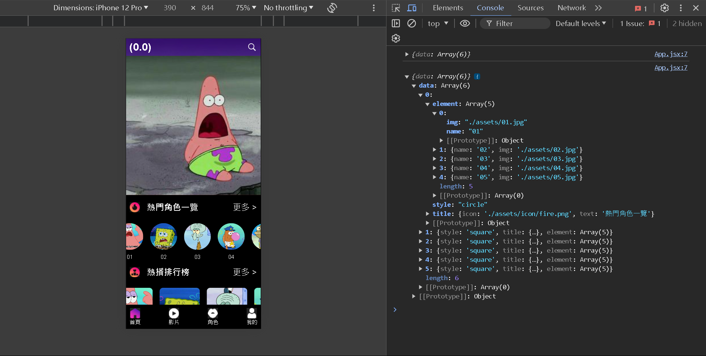

# list app (vite & react)
## 根據/src/data/data.js設定list相關屬性


## Getting Started
1. git clone
2. 移至該專案路徑
3. install node.js 前往 [Node.js 官方網站](https://nodejs.org/en) 下載 Node.js 的安裝包
4. install yarn 這個命令會全局安裝 Yarn
``` bash
npm install -g yarn
```
5. yarn 還原依賴
``` bash
yarn install
```
6. 執行dev模式
``` bash
yarn dev
```